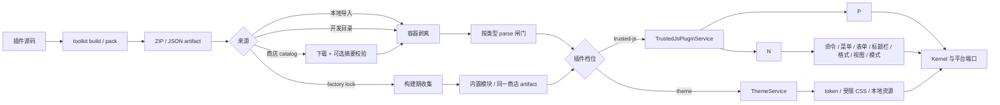
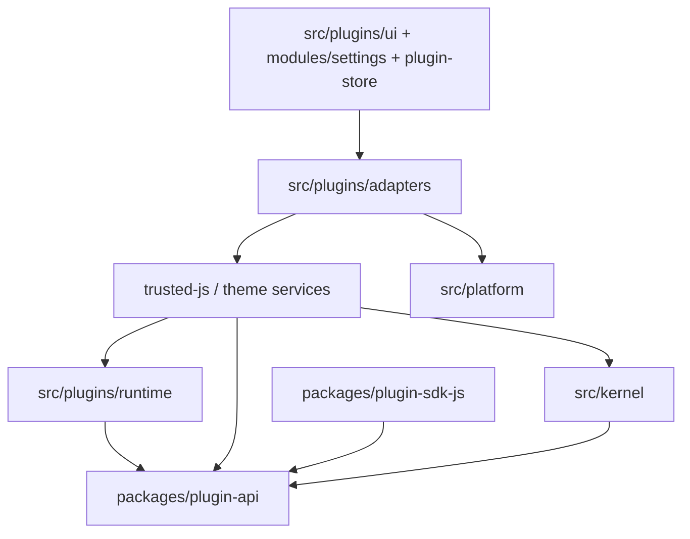
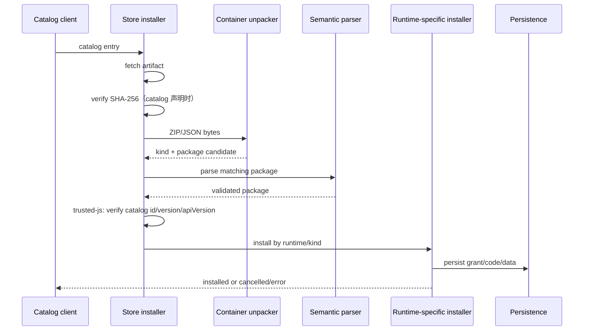
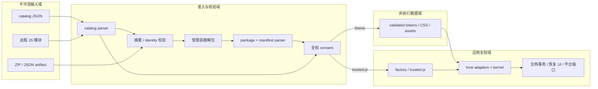

# AMLL TTML Tool 插件系统架构

状态：当前实现快照，唯一的架构参考  
协议状态：experimental v0

本文描述插件系统已经存在的代码、边界和运行路径，是架构、信任模型与协议入口的唯一权威说明。决策理由见 `docs/adr/`；插件作者阅读 `docs/plugin-development-guide.md`；维护者阅读 `docs/plugin-agent-guide.md`；验收步骤见 `docs/plugin-acceptance-checklist.md`；未完成事项与架构调整点只记在 `goal.md`。v0 允许破坏性变更，在全部原定制功能插件通过合同测试前不冻结 v1。

内核永久保留产品的实时核心能力：歌词文档模型与事务、时间轴与打轴交互、AMLL 预览渲染、频谱与波形、音频解码与播放。插件只能通过公开宿主端口访问文档和 UI，不得直接依赖 React 内部状态、Jotai、Tauri、内部 `TTMLLyric`、音频 PCM 或频谱数据。

## 1. 权威来源与阅读规则

发生冲突时，按以下顺序判断当前行为：

1. `packages/plugin-api/src/types.ts`：公开 TypeScript 合同。
2. `packages/plugin-api/src/schema/schemas.ts`：跨边界数据的运行时结构校验。
3. `packages/plugin-api/src/parsers.ts`、`capabilities.ts`：跨字段约束与 capability 声明。
4. `packages/plugin-sdk-js/src/host.ts`：trusted-js 宿主能力面。
5. `src/plugins/**`、`src/kernel/**`、`src/platform/**`：宿主实际行为。
6. ADR、开发手册和 `goal.md`：设计理由、使用说明和后续规划。

`docs/plugin-protocol-v0.md` 由 `pnpm plugin:api:build` 生成，不入库。ADR 记录的是决策发生时的状态，其中部分 MVP 描述早于 trusted-js、本地安装和远程商店实现，不能单独用来判断当前能力。

本文使用以下标记：

- **已实现**：主代码路径已经接通。
- **部分实现**：合同或某个运行档已实现，但其他运行档、平台或 UI 尚未统一。
- **规划**：只存在于路线图或设计说明中。

## 2. 系统一句话模型

插件系统把一个外部或随应用交付的 **artifact**，经过容器剥离、语义校验、授权和持久化，变成一个可启停的 **installation**；运行时为它创建带所有者的 **extension scope**，插件只能通过公开宿主端口修改文档、注册 contribution 或提供主题数据，卸载 scope 即撤销其全部宿主注册。



## 3. 四个正交维度

当前代码里“插件类型”“执行方式”“来源”和“交付方式”容易被混为一谈。调整架构时应把它们视为四个独立维度。

| 维度 | 当前取值 | 决定什么 |
| --- | --- | --- |
| 插件类型 `kind` | `function`、`theme` | 包的语义；功能包与主题包互斥 |
| 执行方式 `runtime` | `builtin`、`trusted-js`、主题专用 `none` | 代码是否执行、隔离方式、可用宿主能力 |
| 安装来源 `source` | `user`、`dev`、`store`，主题为 `builtin/installed`，trusted-js 另有 factory 概念 | 持久化、展示、更新与回退策略 |
| 交付方式 | factory bundle、catalog artifact、catalog 裸模块、本地 ZIP/JSON、开发目录 | artifact 如何到达语义解析闸门 |

这四个维度目前没有一个统一的 `PluginInstallation` 模型。功能插件与主题服务各自保存相近但不同的记录，因此“插件列表中的一行”实际上是 UI 对两类服务状态的聚合视图。

## 4. 核心领域对象

| 对象 | 当前含义 | 主要实现位置 |
| --- | --- | --- |
| `PluginManifest` | 插件身份、版本、类型、运行档、能力请求和静态 contribution 声明 | `packages/plugin-api/src/types.ts` |
| Package | 已解包且可语义校验的载荷；分别为 trusted-js 代码或主题数据 | `TrustedJsPluginPackageV0`、`ThemePackageV0` |
| Artifact | 传输单元，当前支持固定布局 ZIP 和 JSON | `src/plugins/store/package-container.ts` |
| `RemotePluginCatalogEntryV0` | 商店货架条目，描述 artifact 身份、通道、摘要和平台 | `packages/plugin-api/src/remote-catalog.ts` |
| Installation | 某个插件在本机的 manifest、载荷、来源、授权和启用状态 | 目前由功能插件与主题各自的 service/storage 表达 |
| Runtime instance | 一次已加载执行实例及其临时资源 | `PluginInstance`、`LoadedInstance` |
| `ExtensionScope` | 某个 owner 注册到宿主的全部命令、贡献点和事件监听的生命周期容器 | `src/kernel/extensions/ContributionRegistry.ts` |
| Contribution | 插件向宿主声明或动态注册的扩展项 | command、menu、settings、titlebar action、format、trusted view、mode 等 |
| Host port | 插件可调用的宿主能力，不暴露宿主内部对象 | `TrustedJsHostV0` |
| Plugin document | 内部 `TTMLLyric` 的稳定 ID 投影 | `PluginDocumentV0` 与 `PluginDocumentGateway` |
| Runtime state | active/disabled/crash 等运行态和诊断 | trusted-js 维护 |
| Plugin KV | 以 plugin id 隔离的 JSON 值存储 | `IndexedDbPluginKvStorage` |
| Factory copy | 随应用交付、离线可用，可被更高版本更新遮蔽的 trusted-js 副本 | `factory-plugins.lock.json`、`factory-plugins.ts` |

### 4.1 身份关系

当前稳定身份是 `manifest.id`，使用反向域名格式。以下对象都以它为连接键：

- catalog 条目与包内 manifest；
- 持久化 package 和 KV 命名空间；
- runtime instance；
- extension owner；
- command、view、format 等 contribution 的命名空间；
- crash、consent、禁用和 factory pin 状态。

当前模型默认同一 `pluginId` 同时只有一个活动版本。factory、已安装版本和远程候选不是并存实例，而是先解析出一个加载计划，再由选中版本占用该 id。

## 5. 分层与依赖边界



各层职责如下：

| 层 | 职责 | 不应承担的职责 |
| --- | --- | --- |
| `plugin-api` | JSON 可表达的公开合同、Schema、parser、权限规则 | React、DOM、Worker、Tauri、内部歌词模型 |
| `plugin-sdk-js` | trusted-js 的强类型宿主 facade、Mock 和合同测试 | 宿主实现、内部 alias、状态容器 |
| `kernel` | 文档事务、命令和 contribution 注册、格式与主题核心 | 插件容器、远程 catalog、React 页面 |
| `plugins/adapters` | 公开投影与内部模型转换、服务接线 | 新造一套协议或绕过事务服务 |
| `plugins/trusted` | trusted-js 的信任闸门、状态、factory 解析和本地安装 | 假装提供代码隔离 |
| `plugins/store` | catalog、摘要校验、容器剥离、分发安装路由 | 自行执行插件或重复实现语义校验 |
| `plugins/ui` | 权限、consent、管理器、表单和视图宿主 | 直接持久化插件或写歌词 atom |
| `platform` | IndexedDB、Blob URL、DOM style 等环境适配 | 插件策略和业务规则 |

核心依赖规则是：协议不依赖宿主，kernel 不依赖插件 UI/runtime，插件对文档的写入最终只能进入 `EditorDocumentService` 的事务路径。

## 6. 插件档位模型

| 档位 | 信任与隔离 | 能力面 | 生命周期管理 | 当前持久化 |
| --- | --- | --- | --- | --- |
| 宿主内置 `builtin` | 与应用同一信任根、同一 JS 上下文 | 内部 scope，可注册核心 mode/format/theme | 宿主启动代码 | 随应用构建 |
| `trusted-js` | 经准入后视为应用全权；没有安全隔离 | `TrustedJsHostV0`，含 React view、mode、format、匿名 HTTP | `TrustedJsPluginService` + `InstalledTrustedJsService` | IndexedDB `amll-extensions/trusted-js`，运行状态另存 localStorage |
| theme / `none` | 不执行代码；声明式 token、受限 CSS、本地资源 | `ThemeService` | 注册、预览、激活、安全模式 | IndexedDB `amll-extensions/theme-packages`，选择状态另存 key-value storage |

### 6.1 trusted-js

**已实现，但它是准入模型，不是沙箱。** 关键规则：

- factory 模块由应用构建产出，跳过来源和 desktop consent 闸门，但仍参与 crash 记账。
- 非 factory 模块必须通过 API 版本、同源或本地 Blob、桌面开关、用户禁用、崩溃禁用和 consent 检查。
- 第三方本地/商店代码以 Blob 持久化，加载时创建 Object URL。
- 代码内容摘要作为 `consentKey`；同 id 内容变化会重新 consent。摘要只用于内容识别，不代表代码可信。
- `activate({ pluginId, host, signal })` 可返回 cleanup；停用顺序为 abort → cleanup → host handle dispose → scope dispose → Object URL revoke。
- 注册的 command、menu、titlebar、format、mode、view 和事件都归同一个 owner scope。
- factory 更新采用 shadow 模型：更高 semver 的远程或已安装版本可遮蔽 factory；“卸载更新”通过 pin 回退到随应用副本。
- pending crash marker 在执行插件代码前写入，由宿主确认稳定启动后清除；连续失败 3 次进入 `crash-disabled`。

trusted-js 对宿主拥有与应用代码相同的实际权限。`TrustedJsHostV0` 是兼容性和生命周期边界，不是安全边界；即使宿主提供受控 `network.request`，trusted-js 仍可能直接使用浏览器能力。

### 6.2 主题

**已实现。** 主题与功能插件包互斥，不执行代码：

- `ThemePackageV0` 包含 manifest、tokens、受限 CSS 和内联二进制资源。
- parser 校验 token 版本、颜色、资源引用、选择器范围和危险 CSS 结构。
- 资源转换为本地 Object URL，切换或卸载时撤销。
- theme layer 与 user override layer 分离，用户覆盖优先。
- preview 与 active theme 分开；启动 crash marker 可触发安全模式并回落到默认视觉。
- permission、插件管理和错误恢复 UI 位于受保护区域，不受主题 CSS 控制。

### 6.3 宿主核心与 factory 插件

当前存在两种“随应用交付”概念：

- **宿主核心**：编辑模式、宿主原生 TTML 格式、内置主题等直接由宿主注册，不能被普通插件替换；它们是 fail-safe 基座。
- **factory 插件**：已插件化但仍随应用离线交付的功能。当前 `builtin.time-shift` 由独立仓库构建 artifact，宿主用 `factory-plugins.lock.json` 锁定版本与 SHA-256，并在构建期生成 bundled loader。

factory 是来源/分发策略，`trusted-js` 是运行档。两者不应在未来的统一模型中合并成一个枚举。

## 7. 公开协议模型

### 7.1 Manifest 与 contribution

`PluginManifest` 是 `FunctionPluginManifest | ThemePluginManifest` 的判别联合。function manifest 包含：

- 身份：`id`、`name`、`version`、可选作者/主页/许可证；
- 执行：`apiVersion`、`runtime`、`entry`；
- 能力声明：`capabilities`；
- 静态扩展：commands、menus、settings、titlebar actions、formats；
- 激活提示：startup、command、document changed。

Contribution 不是任意 UI 注入。trusted-js 通过 SDK 注册声明式 contribution、React view 与 mode。所有插件 id、command id、view id 和 format id 必须落在自己的命名空间，注册冲突直接失败。

`ExtensionScope` 是贡献生命周期的核心抽象：所有注册返回 disposable，scope 按注册逆序释放。插件崩溃、禁用或卸载时销毁 scope，宿主不需要逐项猜测它注册过什么。

### 7.2 Capability

当前核心 capability：

| Capability | 含义 | trusted-js host facade |
| --- | --- | --- |
| `lyrics.core` | 读取投影、选择与基本编辑 | 文档与选择 API 可用 |
| `lyrics.ruby` | 读取和修改 ruby | 投影当前包含 ruby |
| `lyrics.format` | 文本与歌词投影转换 | `formats.register` |
| `ui.notify` | 纯文本通知 | `ui.notify` |
| `ui.form` | 声明式表单 | `ui.showForm` |
| `storage.kv` | 插件隔离 KV | `storage.kv` |
| `network.http` | 无凭据匿名 HTTP | `network.request` |
| `extensions.<reverse-domain>.<name>` | 定制扩展能力 | 由具体宿主约定 |

能力匹配是精确匹配，不支持通配符。capability 是展示与文档声明；trusted-js 已被视为全权代码，其 SDK 能力面主要用于兼容与资源生命周期，不能阻止插件绕过 facade 使用 Web API。

### 7.3 文档模型与事务

插件看到 `PluginDocumentV0`，不会持有内部 `TTMLLyric`：

```text
PluginDocumentV0
  revision
  lines[]
    id
    words[].id
    timing / text / translation / romanization / ruby ...
  metadata[]
  extensions?
```

写入使用 `DocumentOpV0[]`，包含按稳定 ID 更新、插入、删除、移动、元数据替换和整文档替换。共同不变量：

1. 一批 op 原子提交为一个事务、一个 revision、一个撤销记录。
2. 跨异步边界计算的编辑应携带 `expectedRevision`；冲突返回 `revision-conflict`。
3. adapter 按 ID 合并，投影没有暴露的内部字段保持原值。
4. 新行和新词的 ID 由宿主分配。
5. 变更事件携带来源和受影响的稳定 ID；插件自身造成的事件不会反向形成无限回路。

trusted-js 的一次 `host.document.applyEdit()` 是一个事务，插件若连续调用多次会产生多个事务。

## 8. Artifact、安装与更新

### 8.1 固定容器

容器格式通过 magic bytes 识别，不依赖扩展名：

- ZIP：根目录 `manifest.json`，载荷位于 `assets/<entry>`；
- JSON：已组装的 package object。

容器层只负责安全解包和组装：限制总大小、条目数、单项大小，拒绝绝对路径、反斜杠、dot segment、重复项和未声明文件。语义合法性仍必须进入对应的 `parseFunctionPluginPackage`、`parseTrustedJsPackage` 或 `parseThemePackage`。

### 8.2 商店安装路径



本地导入复用相同容器和语义闸门。开发目录最终也进入对应 service，但 `dev` 来源只在当前会话有效。当前远程 catalog 是单一同源源；多提供者、自托管聚合、跨提供者冲突规则仍是 **规划**。

### 8.3 Factory 构建路径

独立插件仓库负责源码和插件单元测试，toolkit 产出可复现 ZIP 与内容寻址 catalog。宿主只消费锁定 artifact：

```text
独立插件仓库
  -> toolkit build/test/pack
  -> <sha256>.zip
  -> factory-plugins.lock.json (id + version + sha256 + source)
  -> 宿主构建期验证并生成 loader/catalog
  -> 应用内置 factory copy
```

这个路径保证随应用副本与商店分发的是同一组字节。当前远端 Release/静态源发布尚未配置完成，本地 `vendor/plugin-store` 是离线镜像。

## 9. 生命周期与资源所有权

一个功能插件加载后的资源所有权应理解为：

```text
plugin id
  installation record
  runtime instance
    worker/module/object URL
    abort signal / invocation queue
    extension scope
      commands
      contributions
      event listeners
    host handle
      document/selection subscriptions
      open trusted views
      network cancellation
  durable KV namespace
  crash/consent/enabled state
```

卸载与禁用必须先停止新的调用，再取消在途工作，执行插件 cleanup，释放宿主 handle 和 scope，最后关闭 runtime。真正“卸载”还会删除 package、授权/consent、状态和该 id 的 KV；普通“禁用”保留安装数据和 KV。

trusted-js 按上述顺序管理生命周期。主题则使用另一套注册/激活/预览模型。

## 10. 持久化模型

| 数据 | 当前位置 | 键 | 备注 |
| --- | --- | --- | --- |
| trusted-js manifest、Blob、SHA-256、source | IndexedDB `amll-extensions/trusted-js` | plugin id | `dev` 不写入 |
| trusted-js consent/crash/pending/disabled | localStorage | plugin id map | 写失败时退化为会话内状态 |
| factory pin | localStorage | plugin id list | 控制是否回退随应用副本 |
| 插件 KV | IndexedDB `amll-extensions/plugin-kv` | `[pluginId, key]` | 卸载时清除，禁用时保留 |
| 已安装主题包 | IndexedDB `amll-extensions/theme-packages` | theme id | 从旧 localStorage 迁移 |
| 当前主题、安全模式、用户覆盖 | 同步 key-value storage | 固定设置键 | 与主题包分开 |
| 插件网络离线开关 | atom storage/localStorage | `amll-plugin-network-offline` | 只约束 host network port |

当前持久化失败语义并不统一：trusted-js 安装写盘失败会回滚；部分主题和 KV adapter 会记录 warning 后返回。这是调整“安装是否必须持久成功才算成功”时需要优先统一的合同。

## 11. 安全边界与信任模型

安全模型不是简单的“官方/第三方”二分。系统把外部数据校验、内容完整性、用户授权、代码隔离、事务完整性、资源限制和故障恢复组合成多层边界；不同运行档只继承其中与自身相符的保证。

### 11.1 受保护资产

| 资产 | 主要风险 | 当前保护手段 |
| --- | --- | --- |
| 歌词文档和撤销历史 | 越权读取、部分写入、覆盖并发修改、破坏内部字段 | capability、公开投影、稳定 ID、revision、原子事务、adapter 保留内部字段 |
| 用户选择和项目信息 | 超出功能所需的数据暴露 | 只读公开投影；trusted-js 为全权准入 |
| 登录态、PAT 和业务身份 | 插件窃取凭据或冒充用户 | host network port 不带 credentials；trusted-js consent 明示无隔离风险；服务端必须独立鉴权 |
| 浏览器/桌面系统 | DOM、文件、Tauri 或系统 API 被不可信代码调用 | 主题不执行代码；trusted-js 桌面默认关闭并要求全权 consent |
| 宿主 UI 和授权决策 | 主题或插件伪造/遮盖权限、管理和恢复界面 | 声明式普通插件 UI、trusted-only view/mode、主题 selector 白名单、protected region、宿主核心恢复入口 |
| 应用可用性 | 死循环、超大输入、通知/编辑洪泛、崩溃循环 | Worker、超时终止、载荷和 turn 配额、崩溃计数、自动禁用、安全模式 |
| 插件间数据 | 一个插件读取或删除另一个插件的数据和注册项 | plugin id KV 命名空间、owner scope、注册 id 命名空间 |
| 发布和更新完整性 | 下载内容被替换、更新破坏 factory 功能 | artifact 摘要（声明时）、factory 精确 lock、通道类型复核、trusted-js 身份复核、更新失败回退 factory |

### 11.2 威胁假设

当前模型作以下假设：

- catalog、ZIP/JSON、manifest、主题数据与 SDK 请求参数 都是不可信输入，每次跨边界都要解析和校验。
- theme 可以是恶意数据；目标是阻止代码执行、远程资源加载和安全 UI 覆盖。
- `trusted-js` 在 consent 之后进入与应用代码相同的信任域。系统只做执行前准入、来源展示和执行后的可用性恢复，不承诺约束其 DOM、网络、存储、凭据或 Tauri 访问。
- 应用自身代码、构建流水线、factory lock 生成过程和发布 origin 属于可信计算基。它们一旦失陷，插件层不能恢复安全性。
- 业务服务端不信任客户端。资格、提交身份、审阅和其他敏感操作必须在服务端重新鉴权，不能把插件 capability 当作服务端授权。
- 当前没有发布者签名、证书链、信誉系统或透明日志。内容摘要只证明“字节与某个已知摘要一致”，不证明作者身份或代码安全。

当前安全投入主要覆盖有 bug 或一般恶意的插件输入、误操作和可用性故障，不声称抵御已经取得主应用发布权限、同源服务器控制权或用户明确授权的全权 JS。

### 11.3 信任域与跨域路径



图中 `trusted-js` 与宿主位于同一全权域是有意设计，不是图示简化。其 SDK facade 只提供稳定接口和统一生命周期，不形成权限隔离。

### 11.4 边界闸门矩阵

| 边界 | 输入 | 强制检查 | 失败方式 | 明确不保证 |
| --- | --- | --- | --- | --- |
| Catalog | 远程 JSON | schema、版本、重复 id、相对 entry、dot segment | 整份 catalog 拒绝或不可用时跳过 | 发布者身份、条目代码安全；`platforms` 只是运营过滤 |
| Artifact 下载 | 远程字节 | catalog 声明 `sha256` 时校验；factory lock 必须匹配精确摘要 | 安装终止，旧版本/factory 保留 | catalog 中 `sha256` 当前不是必填；摘要不是签名 |
| 容器 | ZIP/JSON | magic bytes、路径、重复项、白名单布局、条目和解压尺寸 | 整包拒绝，不产生部分安装 | manifest 语义和代码行为，交给后续 parser/runtime |
| Package parser | 未知对象 | JSON Schema、manifest、API 版本、kind/runtime、静态 contribution、主题安全规则 | 返回结构化 issue，拒绝安装/恢复 | 插件业务正确性 |
| trusted-js 准入 | factory、同源模块或本地 Blob | API 版本、来源路径、desktop 开关、禁用/crash 状态、consent key | import 前拒绝；更新可回退 factory | 代码开始执行后的任何沙箱保证 |
| 文档提交 | op batch + revision | schema、稳定 ID、能力、expected revision、单事务 | 全批拒绝，不部分写入 | 用户已经授权的合法但不理想修改 |
| Contribution | 注册 id 和 owner | owner 命名空间、全局冲突、trusted-only view/mode、数量限制 | 注册抛错，scope 可整体释放 | trusted-js 自己直接操作 DOM |
| 持久化 | package、状态、KV | plugin id 命名空间、恢复时重新解析 | 各 adapter 语义目前不完全一致 | 跨 store 原子事务；浏览器配额可用性 |

### 11.5 Artifact 与供应链边界

容器解包的当前硬限制如下：

| 资源 | 上限 |
| --- | --- |
| 原始 ZIP/JSON artifact | 48 MiB |
| ZIP 解压后总大小 | 64 MiB |
| 单个 ZIP entry | 33 MiB |
| `manifest.json` | 4 MiB |
| ZIP 文件条目数 | 64 |
| trusted-js package 中的代码字符串 | 16 MiB |
| 单个主题 CSS 文件 | 131072 字符 |

ZIP entry 必须使用相对正斜杠路径，不能包含空段、`.`、`..`、绝对路径、反斜杠或重复名称；固定布局之外的文件会使整个包失败。这一层用于防路径穿越、意外附带文件和常见解压膨胀，不替代语义 parser。

内容完整性存在三种不同强度：

1. factory artifact 由 `factory-plugins.lock.json` 锁定版本和 SHA-256，构建时验证。
2. 商店 ZIP/JSON artifact 仅在 catalog 提供 `sha256` 时校验。两种通道都会核对容器类型；当前只有 trusted-js 继续核对包内 id、version、API version 与 catalog 条目，主题验证包自身语义。
3. catalog 中的裸 trusted-js 模块直接从同源 URL 动态 import。当前 loader 不验证 catalog `sha256`，也不把它作为 `consentKey`；这条路径依赖 TLS、同源服务器和发布流程，内容变化不会像本地 Blob 包一样按摘要强制重新 consent。

因此，SHA-256、同源和 `firstParty` 的含义必须分开：SHA-256 是内容身份，同源是交付边界，`firstParty` 是宿主给予的信任策略。三者都不是代码签名。若后续支持第三方 provider，应把摘要设为 artifact 的必需身份，并在执行前验证实际字节。

### 11.7 trusted-js 准入边界

trusted-js 的边界全部发生在代码执行之前：

- factory module 与主应用同一构建和信任根，跳过用户 consent 与 desktop remote gate；
- 远程裸模块必须解析到应用 origin 内；
- 本地/商店 package 经 parser 后保存为 Blob，包内容 SHA-256 作为 consent key，内容变化重新询问；
- 桌面端非 factory trusted-js 默认关闭；
- 用户禁用、连续崩溃和上次启动残留 pending marker 都在 import 前检查；
- consent 明示插件可读取和修改应用数据、读取凭据并以用户身份操作；桌面端还提示系统风险。

一旦 `import()` 开始，trusted-js 就能以应用前端的权限运行。它可以绕过 `TrustedJsHostV0` 直接使用可见的 DOM、Web API、存储、网络以及桌面 WebView 暴露的能力。以下机制对 trusted-js 只是兼容性或可用性机制，不是安全隔离：

- `TrustedJsHostV0` 与 capability 名称；
- host network offline switch；
- `data-amll-protected`；
- owner namespace 和 scope；
- AbortSignal、cleanup 和 crash counter。

当前 `index.html` 的 CSP 允许广泛来源、`blob:`、`unsafe-inline` 和 `unsafe-eval`。它满足现有应用与插件加载需求，但不是约束 trusted-js 或供应链注入的安全边界。若未来要把 CSP 纳入安全模型，需要单独清点应用依赖、Tauri IPC、Worker、动态 import 与开发模式后收紧，并建立自动化响应头/页面策略测试。

### 11.8 主题与安全 UI 边界

主题是“不执行代码”的数据档。`parseThemePackage` 是唯一语义入口，并执行以下限制：

- token 只接受已知名称和受限字面值，拒绝 `url()`、`var()`、`expression()`、`@import`、协议和结构字符；
- CSS 最长 131072 字符，嵌套深度最多 4；只允许 `@media`、`@supports` 和受限 `@font-face`；
- selector 必须从公开的 `[data-slot]` 或 `[data-part]` 开始；
- 拒绝 `!important`、escape、危险函数、远程/data/blob/file/javascript URL；
- `url()` 只能引用包内声明的 `asset:<name>`，应用时替换成宿主生成的本地 URL；
- 明确拒绝任何包含 `data-amll-protected` 的主题 CSS。

主题 CSS 位于 `amll.theme` cascade layer，用户覆盖位于更高的 `amll.user` layer，宿主未分层 CSS 仍高于两者。权限、consent、设置和插件管理对话框 portal 到 body 并标记 `data-amll-protected`，避免主题通过正常选择器或层叠覆盖决策界面。完整 mode 和 React view 只允许 trusted owner 注册。

主题应用前写入 pending marker；应用未稳定便崩溃时，下次启动进入安全模式。用户还能通过 `Ctrl+Alt+Shift+F12` 捕获阶段快捷键恢复默认主题，或用 `?theme-safe-mode=1` 强制本次安全启动。

这些保护只约束主题包。已经获准运行的 trusted-js 可直接修改 DOM/CSS，因此可以影响 protected UI；这正是它必须按全权代码处理的原因。

### 11.9 网络与凭据边界

`network.http` host port 的策略是“匿名、有限、可取消”：

- 只允许绝对 HTTPS URL，以及 `localhost`、`127.0.0.1`、`[::1]` 的 HTTP；拒绝 URL 凭据和其他 scheme；
- 禁止插件设置 `authorization`、cookie、proxy authorization、host、origin、referer 和 hop-by-hop header；
- `fetch` 固定使用 `credentials: "omit"`、`redirect: "error"`、`referrerPolicy: "no-referrer"`；
- 请求体最多 1 MiB，响应体最多 8 MiB；默认超时 30 秒，最大 120 秒；卸载会取消请求；
- 离线开关拒绝经该 port 发起的新请求；浏览器/Tauri WebView 的 CORS 规则仍适用。

该端口不实现域名 allowlist、DNS 解析检查或私网 HTTPS 地址过滤。它防止宿主主动附带用户凭据，不阻止拥有文档读取和网络能力的插件主动外传数据。trusted-js 可以完全绕过该 port 直接联网，所以离线开关不能作为 trusted-js 的网络隔离。

宿主持有的 PAT、登录态和服务端 token 不应出现在 `PluginDocumentV0`、KV或日志中。对 trusted-js 只能通过全权 consent 和发布治理管理该风险，不能靠前端对象隐藏建立安全保证。

### 11.10 文档、表单与 contribution 完整性边界

事务层保护文档一致性，而不是判断编辑内容是否“正确”：

- 插件只得到公开投影，内部字段不会因 patch 丢失；
- 所有定位使用稳定 ID；未知目标使事务失败；
- revision 冲突整批拒绝；一个 turn/applyEdit 对应一个撤销记录；
- 来源 plugin id 随事务传播，事件回送时避免自触发循环。

声明式表单在协议入口和 UI service 再次校验，字段、选项、文本和层级都有上限；提交值按 schema 清洗，丢弃未知键、限制文本和数字范围，并校验 select/radio 成员。通知是纯文本，图标只允许宿主预编译的 Fluent icon 白名单。普通插件不能传 HTML、SVG、URL、React component 或内联回调。

Contribution registry 强制 plugin id 命名空间和 owner 归属；mode、trusted view、host-native format 只允许 trusted owner。标题栏 action 是数量受限的命令引用和白名单图标，不能占据窗口控件或恢复入口。scope disposal 只清理经宿主 API 注册的资源；trusted-js 自行创建的全局 listener、timer 或 DOM 仍需插件 cleanup，宿主无法可靠枚举。

### 11.11 可用性与恢复边界

| 故障 | 当前恢复行为 |
| --- | --- |
| catalog 不可达/非法 | 不加载远程候选；factory 功能继续可用 |
| artifact 摘要或语义校验失败 | 安装终止，不执行候选代码 |
| factory 更新加载失败 | 尝试重新加载 factory 副本 |
| trusted-js import/activate 失败 | abort、释放 host/scope/Object URL、记录 crash；更新可回退 factory |
| trusted-js 导致整次启动异常 | pending marker 在下次启动累计 crash，达到阈值后拒绝加载 |
| 主题应用导致启动异常 | 下次启动进入主题安全模式并清除主题效果 |
| active mode 的 owner 消失 | 回退到内置 `edit` mode |
| 插件禁用/卸载 | 取消在途工作并释放 owner scope；卸载另清 package 与 KV |

安全恢复入口必须属于宿主核心：默认编辑模式、host-native TTML、插件管理、权限/consent、主题安全模式和恢复快捷键均不能依赖可卸载插件才能访问。

### 11.12 当前残余风险与非保证

调整架构时不应把以下事项误认为已经解决：

1. trusted-js 没有运行时隔离，可能读取凭据、篡改 UI、直接联网或调用桌面能力。
2. 当前 CSP 宽松，不提供脚本来源约束或 trusted-js containment。
3. 远程裸 trusted-js 模块没有实际字节摘要校验，内容变化也没有摘要驱动的重新 consent。
4. catalog artifact 的 `sha256` 是可选字段；系统没有发布者签名、撤销或透明日志。
5. 商店中的主题包尚未把包内 id/version/API version 与 catalog 条目逐项比对。
7. host network port 没有 hostname allowlist 或私网 HTTPS 过滤，并不构成防数据外传机制。
8. 主题/KV 的部分持久化 adapter 会吞掉写失败，安装和持久成功的语义尚未统一。
9. localStorage 不可用时，trusted-js crash/pin 状态会降级，factory pin 可能只在当前会话有效。
10. `data-amll-protected` 只约束经过校验的主题 CSS，不能抵抗全权 JS 或宿主自身 CSS/DOM bug。
11. Web/Tauri 的真实隔离还依赖浏览器、WebView和 Tauri 配置；桌面跨平台验证尚未全部完成。

## 12. 当前不变量

后续重构如果没有明确 ADR 变更，应保持这些行为：

1. `plugin-api` 保持宿主无关且可独立构建。
2. 外部插件只依赖公开 API/SDK，不能导入 `$/` 或宿主内部类型。
3. 每条 artifact 路径最终进入唯一的对应语义 parser。
4. 文档写入只经事务服务；稳定 ID、revision、原子提交和撤销语义不变。
5. capability 精确匹配，未知 capability 拒绝，不做前缀通配。
6. 插件只能注册自己命名空间下的命令和贡献。
7. scope disposal 能撤销插件的全部宿主注册。
9. trusted-js 明确按全权代码处理，不把 SDK facade 描述成沙箱。
10. 主题不执行代码，受保护 UI 不受主题样式影响。
11. factory copy 离线可用；更新失败可回退，商店不可用不会移除基础功能。
12. host-native TTML 和 fallback edit mode 始终由可信、不可销毁的宿主核心提供。


## 13. 仍然有效的历史决策

以下条目来自已完成阶段的记录，仍约束后续工作；决策的时间语境见 ADR 与 git 历史。

### 13.1 分层检查规则

`scripts/check-editor-boundary.mjs`（`pnpm lint:boundaries`，CI 执行）现行规则，新增模块须遵守：

- 相对导入按解析后的真实目标校验，不能以 `../../modules/...` 绕过 application/kernel 边界。
- 宿主全局补查小写 `document`、`window`、`localStorage`、`fetch` 等。
- 遍历 `tests/plugin-api/` 与 `tests/plugin-sdk-js/`；`src/platform` 与 `src/plugins`（runtime、adapters、ui、trusted、store 与根目录）有正向依赖白名单。
- UI 不得以别名或相对路径直接导入纯算法模块（drag-reorder、segmentation、syllable-smoothing、LRC parser、时间线边界等），只能经 application service 与 adapter；`?worker` 资源只能由 platform/runtime adapter 引入。
- 普通菜单项不得重新内联 `onSelect`/`onClick`/`onCheckedChange`（菜单只引用 command ID）。
- state 层不得重新访问 idb、fetch、localStorage 或 Object URL API（走 platform adapter）。
- `src/plugins/builtin/<plugin>/**`（formats/modes/themes 三个宿主核心目录除外）与 `examples/` 只允许导入 `@amll-ttml-tool/plugin-api`、`@amll-ttml-tool/plugin-sdk-js` 与 React；SDK 包只允许 plugin-api 与 type-only React。

### 13.2 格式插件的粒度

插件化的单位是“provider 注册”，不是“实现打包”。TTML 由自有 ttml-processor 承担，ESLRC/QRC/YRC/LYS/ASS 来自上游 `@applemusic-like-lyrics/lyric` 包，LRC 为 TS。这些实现属于主线程内部库，由单一 builtin scope `core.formats` 注册多个 provider。TTML 注册为不可卸载 hostNative provider；其余 provider 可禁用，禁用后对应导入/导出命令随 scope 消失。第三方格式插件经 trusted-js `formats.register` 接入同一 registry 与同一文件流程。

### 13.3 两档用户提示语与两条红线

用户提示语按两档说明信任边界，措辞不得混淆“浏览器保护的是系统、不是账号”：

1. 主题：不执行代码，token、CSS 与资源引用由宿主校验。
2. JS 插件：与应用同权，可访问应用数据和登录态；桌面端还可能访问系统能力，应像安装软件一样审查来源。

不随规模松动的红线：凭据（PAT/登录态）由宿主持有，不进插件可读存储、不进文档投影，宿主 API 不提供凭据原文；业务 API 鉴权在服务端，不信任客户端。trusted-js 与应用同处 JS 环境，接口约定不构成对任意 JS 的凭据隔离保证。只有随应用构建的 factory 模块免 consent，所有远程 trusted-js（含第一方更新）均须用户授权。

### 13.4 一级页面、标题栏与表单的信任结论

- 完整 React mainView 只由已准入的 builtin/trusted scope 注册，manifest 不能声明 mode。`FALLBACK_MODE_ID = "edit"`，edit 模式禁止携带 `when`，模式切换器位于 `data-amll-protected` 内。
- 标题栏承载模式切换器与窗口控制，属恢复入口。第三方最多获得声明式动作位（每 manifest ≤3 条，自身 command ID + 宿主图标白名单 + 纯文本 tooltip），不得触碰窗口拖拽区、窗口控制和模式切换器。
- 表单不向协议开放 CSS 文本；若未来需要主题动画，应在主题合同内以受限 `@keyframes` 另行扩展。

### 13.5 主题 slot / part 合同

slot：app-root、background-layer、title-bar、ribbon-bar、sidebar、lyric-editor、preview、audio-controls、spectrogram、plugin-form；part：lyric-line、lyric-word、form-field、form-group、form-note、form-footer。主题 CSS 的每个选择器必须以 `[data-slot="…"]` 或 `[data-part="…"]` 锚定，名称在 `THEME_SLOT_NAMES_V0` / `THEME_PART_NAMES_V0` 白名单内。`index.css` 声明 `@layer amll.base, amll.theme, amll.user`，未分层的应用 CSS 永远压过三层。新增 slot/part/token 名需扩展 `THEME_*_NAMES_V0` 并 bump `THEME_TOKEN_VERSION`。

### 13.6 trusted-js SDK 合同要点

- 分包 `packages/plugin-sdk-js`（`@amll-ttml-tool/plugin-sdk-js`，`./testing` 子路径导出 `MockTrustedJsHost` 与 `createTrustedJsHostUnderTest`）。不走 pnpm workspace，靠 tsconfig paths 与 Vite/Vitest alias 解析；React 只允许 `import type`。`pnpm plugin:sdk:check` 证明可脱离宿主编译。
- `TrustedJsHostV0`：`document.readSnapshot()` 返回含 ruby 的 `PluginDocumentV0`；`revision` 为 getter；`applyEdit(ops, label, { expectedRevision? })` 省略 expectedRevision 即不校验冲突；`onChanged` 事件含 `sourcePluginId`；`selection.get()` 只读并有 `selection.onChanged`；`commands`/`menus`/`titleBarActions`/`formats`/`views` 均是 ExtensionScope 薄封装；formats provider 以投影转换（importer 返回 `NewLineV0[]` + metadata，宿主分配 id）；`storage.kv` 直读写 `amll-extensions/plugin-kv` 命名空间；`views.registerMode` 经 `registerHostMode`。
- 宿主共享服务 `src/plugins/adapters/host-services.ts` 接入 trusted-js 宿主，保证事务、revision 冲突、来源标记与 KV 命名空间。`createTrustedJsHost` 为端口注入的纯工厂，可在 Node 中与 `EditorDocumentService` 组成真实宿主。
- 加载合同：`createHost({ pluginId, scope, signal })` 返回 handle；`activate({ pluginId, host, signal })` 返回 cleanup；unload 顺序固定为 abort → cleanup → host handle dispose → scope dispose；activation 抛错同样 abort 并全清理。
- 合同测试入口 `runHostContractTests` 由 MockTrustedJsHost 与真实 trusted-js 宿主共用。
- 热重载：工具链成功构建后发布 `dist/module/manifest.json` 与入口模块，编译失败保留上次输出；宿主监听归应用会话所有；开发 consent 按同 id 的当前会话复用，与正式包的内容授权、崩溃计数分开；激活失败清理新实例并重新激活旧模块，KV 和文档不清空。

## 14. 代码索引

| 主题 | 文件 |
| --- | --- |
| 公共类型 | `packages/plugin-api/src/types.ts` |
| Schema 与 parser | `packages/plugin-api/src/schema/schemas.ts`、`packages/plugin-api/src/parsers.ts` |
| Capability | `packages/plugin-api/src/capabilities.ts` |
| 匿名网络策略 | `packages/plugin-api/src/network.ts`、`src/plugins/adapters/plugin-network.ts` |
| trusted-js SDK | `packages/plugin-sdk-js/src/host.ts` |
| Contribution/owner scope | `src/kernel/extensions/ContributionRegistry.ts` |
| 文档事务 | `src/kernel/editor/EditorDocumentService.ts` |
| 插件文档 adapter | `src/plugins/adapters/plugin-document.ts` |
| trusted-js load gate | `src/plugins/trusted/trusted-js-service.ts` |
| trusted-js 本地安装 | `src/plugins/trusted/installed-trusted-js.ts` |
| factory/更新选择 | `src/plugins/trusted/factory-plugins.ts`、`trusted-js-load-plan.ts` |
| 主题核心 | `src/kernel/theme/ThemeService.ts` |
| 主题 CSS 安全校验 | `packages/plugin-api/src/theme-css.ts`、`theme-package.ts` |
| 容器与商店安装 | `src/plugins/store/package-container.ts`、`store-install.ts` |
| 权限与 consent UI | `src/plugins/ui/PluginPermissionDialog.tsx`、`TrustedJsConsentDialog.tsx` |
| 页面 CSP | `index.html` |
| 平台持久化 | `src/platform/storage/IndexedDb*.ts` |
| 工厂锁 | `factory-plugins.lock.json` |
| 当前路线图 | `goal.md` |
| 架构决策 | `docs/adr/0001-plugin-architecture.md` 至 `0003-kernel-command-contribution.md` |

### 扩展持久化

插件、主题与用户背景共用 `amll-extensions`，仅 `src/platform/storage/plugin-database.ts` 打开连接，负责升级、阻塞关闭、终止与打开失败后的重试。四个 object store 为 `trusted-js`、`plugin-kv`（复合键 `[pluginId, key]`）、`theme-packages` 与 `theme-assets`。历史快照继续使用 `amll-autosave-db`；localStorage 中的授权、启用、factory pin、主题选择与 override 键保持不变。分支未上线，不迁移旧 IndexedDB 库。

主题包资源以 Blob 存入 `theme-assets`，通过 `themeId` 索引关联包；用户 surface 图片以 surface 名为键，不归属于任何主题。全局背景为 `appRoot` surface，设置入口统一到主题设置。卸载 trusted-js 时一个事务删除包与其 KV 范围；卸载主题时一个事务删除包及其资源，保留用户 surface 图片。失败安装的回滚仅删除包，不清空已有 KV。
